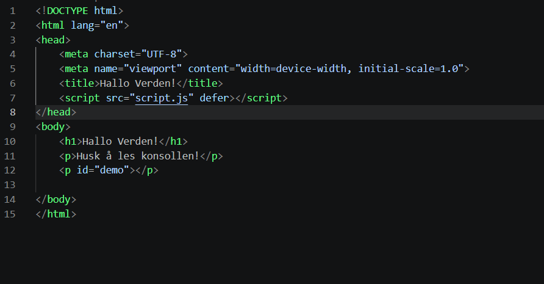
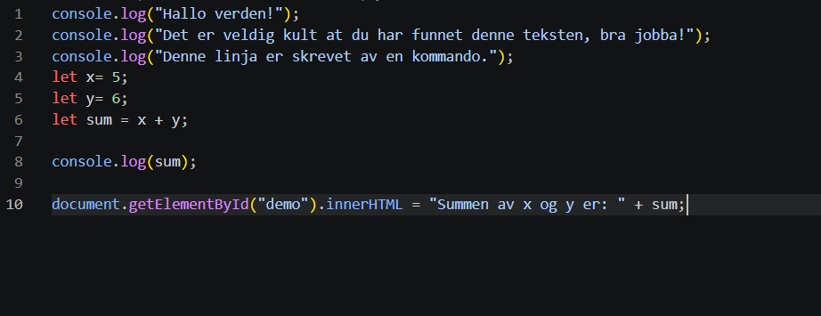
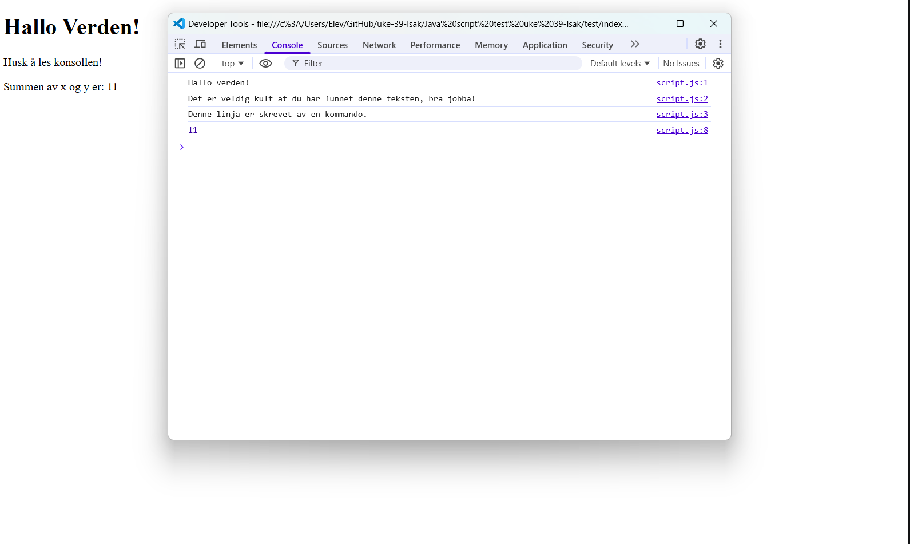

# uke-39-Isak

# Hva har jeg gjort til nå i dette prosjektet?

* Jeg har laget en konto på GitHub
* Jeg har lastet ned GitHub desktop
* Jeg har logget inn på GitHub desktop
* Jeg har laget en practice.md fil

### Hva jeg har gjort i practice.md filen:

`1.` Jeg har laget en overskrift til filen.

`2.` Jeg har laget en punktliste. her har jeg brukt ulike frukter og grønnsaker + banan som er et bær

`3.` Jeg har laget en nummerert liste der jeg rangerer de ulike ukedagene. 

`4.` Jeg har lagt inn en githublink og også senere fikset slik at beskrivelsen er riktig. 

`5.` Jeg har lagt inn tekst i Kursiv. 

`6.` Jeg har lagt inn fet tekst som forteller at imorgen skal vi jobbe med et annet tema. 

`7` Jeg har lagt inn et bilde med bildebeskrivelse. ¨

`8.` Jeg har laget en kodeblokk.

`9.` Jeg har lagt inn overskrift, punktliste og nummerliste i dette dokumentet her "README.md" 

`10.` Jeg har skrevet svar på refleksjonsspørsmålene

---

## Mine Refleksjoner

* Jeg har lært om hvordan jeg kan laste opp ulike prosjekter til GitHub. 

* Jeg synes at å bruke versjonskontroll gikk helt fint, og jeg tror at det er et godt verktøy å ha med til videre programmeringsprosjekter. 

* Jeg har lært hvordan jeg kan lage overskrift, punktliste, nummerliste, fet tekst og tekst i kursiv, og flere andre ting i Markdown.

* Markdown kan brukes til dokumentasjon ved at man enkelt kan lage ting som punktlister, nummerlister, overskrifter og mer, og det er og ganske enkelt å skrive inn. Jeg tror også det kan være mer effektivt at både programmeringen og dokumentasjonsbiten bruker samme program slik at man slipper å bytte imellom de ulike programmene.

* Det som var mest utfordrende var nok å lage kodeblokk, og å lage link-beskrivelse, ettersom det var de eneste punktene som jeg ikke klarte på mitt aller første forsøk. 

# Bli kjent med Java-Script

## Hva har jeg prøvd ut? 
Jeg har prøvd ut det å skrive en veldig enkel kode i Javascript. 
Jeg har testet hvordan jeg kan få konsollen til å skrive tekst med print, og også fått den til å regne ut summen av to ulike variabler.
Jeg har definert variabler, og koblet dem opp mot HTML-filen, slik at om man trykker på en knapp, så skal tallet øke med 1, 2 eller 10, eller redusere med 1, 2 eller 10. 

## Hva har jeg lært?
Jeg har lært mer om hvordan man kan bruke Javascript til å lage og endre på variabler, og å skrive tekst. Jeg har og lært litt om hvordan jeg kan koble Java-script opp mot HTML-fil. Jeg har og lært at når koden blir veldig gjentagende og ganske lik, så er det mye raskere å kopiere deler av koder og endre på småting som skal endres på, istedet for å skrive det samme mange ganger på rad. 

## Utfordringer jeg møtte
Jeg hadde en utfordring der den ene linja med kode var lagt inn i index.html istedet for script.js. Da ville ikke koden fungere som den skulle. Derfor spurte jeg ChatGPT om den kunne finne og forklare til meg hva som var gjort feil **uten** å løse koden for meg, slik at jeg selv måtte finne og fikse på feilen. Jeg mener at dette er bedre enn å bare kopiere koden rett inn, fordi jeg faktisk må finne ut av hvor feilen er selv, noe som kan la meg lettere huske på feilen, slik at det forhåpentligvis ikke blir et stort problem en gang i fremtiden.

### Bilder av kode for test-delen i "Bli kjent med Java-Script"

 Bilde av koden i index.html på test-oppgaven 

 Bilde av koden i script.js på test-oppgaven 

 Bilde av resultatet av koden i script.js og index.html på test-oppgaven 

